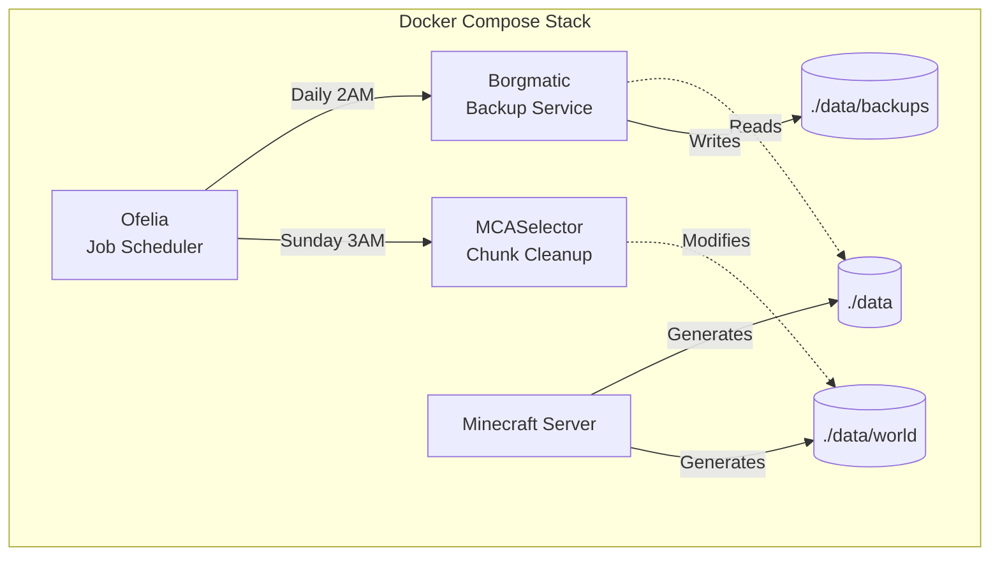

# Architecture

## System Overview



## Services

### Ofelia
- **Purpose**: Schedule and execute jobs across containers
- **Config**: `ofelia/config.ini`
- **Trigger**: Cron schedules

### Borgmatic
- **Purpose**: Create encrypted incremental backups
- **Config**: `./data/config/borgmatic/config.yaml` (auto-created)
- **Storage**: `./data/backups/borg-repository`
- **Encryption**: repokey-blake2
- **Retention**: 7 daily, 4 weekly, 6 monthly

### MCASelector
- **Purpose**: Delete old/unused chunks
- **Config**: `./data/config/mcaselector-options.yaml` (auto-created)
- **Criteria**: LastUpdated + InhabitedTime

## Data Flow

**Backup (Daily 2AM)**
```
Ofelia → Borgmatic → Read ./data → Encrypt & Compress → ./data/backups/borg-repository
```

**Cleanup (Sunday 3AM)**
```
Ofelia → MCASelector → Analyze ./data/world → Delete matching chunks
```

## Volume Mounts

| Service | Source | Target | Mode |
|---------|--------|--------|------|
| Borgmatic | `./data` | `/mnt/source` | ro |
| Borgmatic | `./data/backups/borg-repository` | `/mnt/borg-repository` | rw |
| Borgmatic | `./data/config/borgmatic` | `/etc/borgmatic.d` | rw |
| MCASelector | `./data/world` | `/world` | rw |
| MCASelector | `./data/config` | `/config` | rw |
| Ofelia | `/var/run/docker.sock` | `/var/run/docker.sock` | ro |
| Ofelia | `./ofelia/config.ini` | `/etc/ofelia/config.ini` | ro |

## Configuration Files

| File | Purpose | When Created |
|------|---------|--------------|
| `ofelia/config.ini` | Job schedules | Pre-configured |
| `./data/config/borgmatic/config.yaml` | Backup settings | First run |
| `./data/config/mcaselector-options.yaml` | Cleanup rules | First run |
