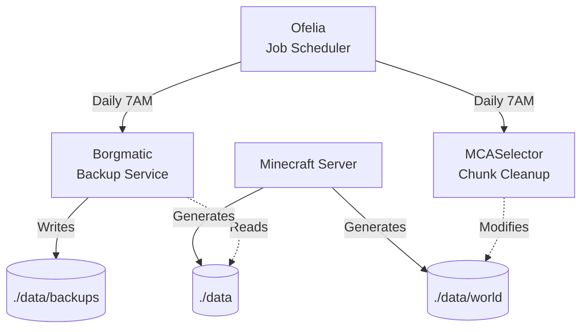

# Architecture

## System Overview



## Components

### Ofelia

- **Image**: `mcuadros/ofelia:latest`
- **Config**: `ofelia/config.ini`

### Borgmatic

- **Image**: `eclarift/borgmatic:latest` (custom)
- **Config**: `./data/config/borgmatic/config.yaml`
- **Storage**: `./data/backups/borg-repository`

### MCASelector

- **Image**: `eclarift/mcaselector:latest`
- **Config**: `./data/config/mcaselector-options.yaml` (auto-created)
- **Purpose**: Delete old chunks based on LastUpdated + InhabitedTime

## Data Flow

### Backup (Daily 7AM)

Ofelia → Borgmatic → Read ./data → Encrypt & Compress → ./data/backups/borg-repository

### Cleanup (Daily 7AM)

Ofelia → MCASelector → Analyze ./data/world → Delete matching chunks

## Configuration Files

| File | Purpose | When Created |
|------|---------|--------------|
| `ofelia/config.ini` | Job schedules | Pre-configured |
| `./data/config/borgmatic/config.yaml` | Backup settings | First run |
| `./data/config/mcaselector-options.yaml` | Cleanup rules | First run |

## Files Added

```bash
borgmatic/
├── Dockerfile
├── scripts/{backup.sh, entrypoint.sh}
└── templates/borgmatic-config.yaml

mcaselector/
├── scripts/entrypoint.sh (updated)
└── templates/mcaselector-options.yaml (renamed from options.yml)

ofelia/
└── config.ini
```
