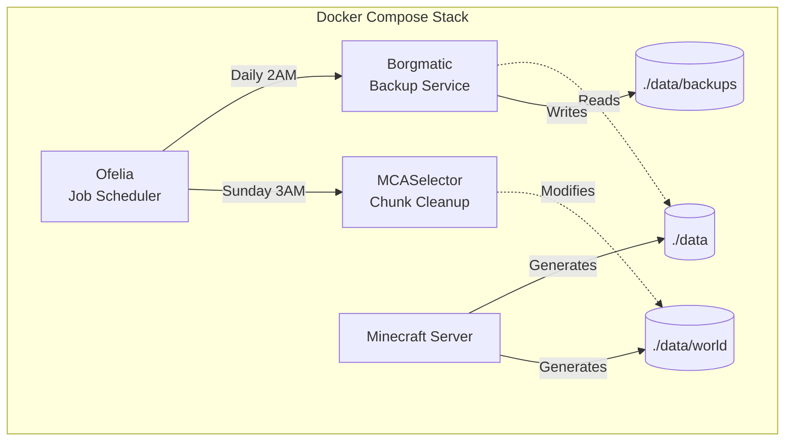

# Architecture

## System Overview



## Components

### Ofelia
- **Image**: `mcuadros/ofelia:latest`
- **Config**: `ofelia/config.ini`
- **Purpose**: Schedule jobs via cron syntax

### Borgmatic
- **Image**: `eclarift/borgmatic:latest` (custom)
- **Config**: `./data/config/borgmatic/config.yaml` (auto-created)
- **Purpose**: Encrypted incremental backups
- **Storage**: `./data/backups/borg-repository`
- **Encryption**: repokey-blake2
- **Retention**: 7 daily, 4 weekly, 6 monthly

### MCASelector
- **Image**: `eclarift/mcaselector:latest`
- **Config**: `./data/config/mcaselector-options.yaml` (auto-created)
- **Purpose**: Delete old chunks based on LastUpdated + InhabitedTime

## Data Flow

**Backup (Daily 2AM)**
```
Ofelia → Borgmatic → Read ./data → Encrypt & Compress → ./data/backups/borg-repository
```

**Cleanup (Sunday 3AM)**
```
Ofelia → MCASelector → Analyze ./data/world → Delete matching chunks
```

## Default Schedules

| Job | Schedule | Description |
|-----|----------|-------------|
| borgmatic-backup | 0 2 * * * | Daily 2 AM backup |
| mcaselector-cleanup | 0 3 * * 0 | Sunday 3 AM cleanup |

## Volume Mounts

| Service | Source | Target | Mode |
|---------|--------|--------|------|
| Borgmatic | `./data` | `/mnt/source` | ro |
| Borgmatic | `./data/backups/borg-repository` | `/mnt/borg-repository` | rw |
| Borgmatic | `./data/config/borgmatic` | `/etc/borgmatic.d` | rw |
| MCASelector | `./data/world` | `/world` | rw |
| MCASelector | `./data/config` | `/config` | rw |
| Ofelia | `/var/run/docker.sock` | `/var/run/docker.sock` | ro |
| Ofelia | `./ofelia/config.ini` | `/etc/ofelia/config.ini` | ro |

## Configuration Files

| File | Purpose | When Created |
|------|---------|--------------|
| `ofelia/config.ini` | Job schedules | Pre-configured |
| `./data/config/borgmatic/config.yaml` | Backup settings | First run |
| `./data/config/mcaselector-options.yaml` | Cleanup rules | First run |

## Files Added

```
borgmatic/
├── Dockerfile
├── scripts/{backup.sh, entrypoint.sh}
└── templates/borgmatic-config.yaml

mcaselector/
├── scripts/entrypoint.sh (updated)
└── templates/mcaselector-options.yaml (renamed from options.yml)

ofelia/
└── config.ini
```
