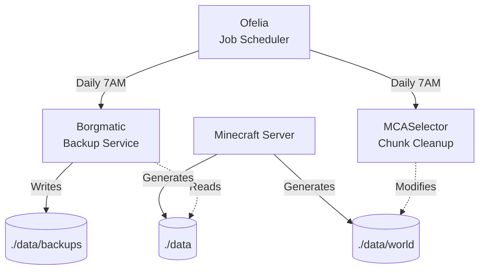

# Architecture

## System Overview



## Components

| Component | Image | Config Location |
|-----------|-------|-----------------|
| Ofelia | `mcuadros/ofelia:latest` | `ofelia/config.ini` |
| Borgmatic | `eclarift/borgmatic:latest` | `./data/config/borgmatic/config.yaml` |
| MCASelector | `eclarift/mcaselector:latest` | `./data/config/mcaselector-options.yaml` |

## Custom Docker Images

Custom images are built for Borgmatic and MCASelector to include project-specific scripts and templates:

```
borgmatic/
├── Dockerfile
├── scripts/{backup.sh, entrypoint.sh}
└── templates/borgmatic-config.yaml

mcaselector/
├── scripts/entrypoint.sh
└── templates/mcaselector-options.yaml
```
